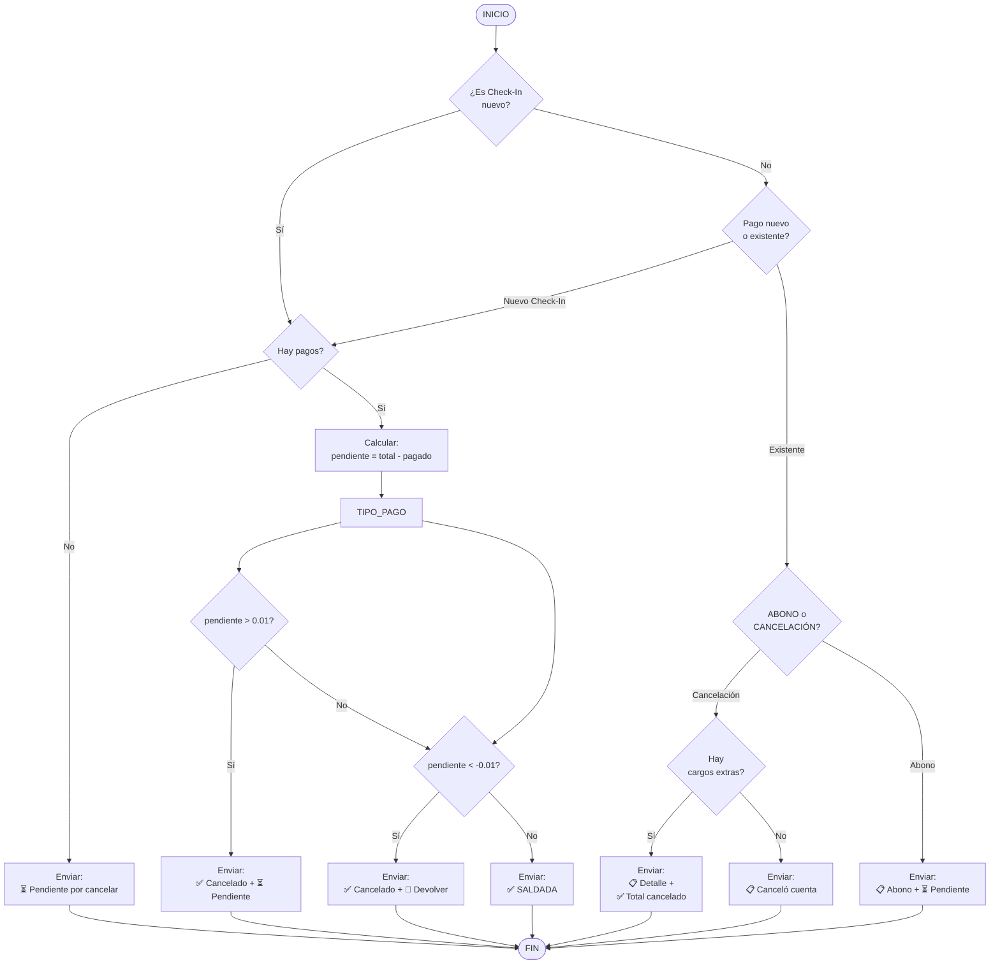

# Flujo de Check-In y Mensajes de Telegram

## Diagrama General de Flujo

```mermaid
flowchart TD
    subgraph CHECKIN["PROCESO DE CHECK-IN"]
        A[Iniciar Check-In<br/>Habitación Libre] --> B[Ingresar Datos del Huésped]
        B --> C{¿Cliente acepta<br/>pagar ahora?}
        
        C -->|Sí| D[Registrar Estadía<br/>en Base de Datos]
        C -->|No| E[Registrar Check-In<br/>Pendiente]
        
        D --> F[Mostrar Diálogo<br/>de Cobro]
        E --> G[Enviar mensaje:<br/>⏳ Pendiente por cancelar]
        
        F --> H{¿Hay pagos<br/>registrados?}
        
        H -->|Sí| I[Calcular Total Pagado<br/>vs Precio Habitación]
        H -->|No| J[Mostrar mensaje de<br/>Error - Sin pagos]
        
        I --> K{Pendiente > 0.01?}
        I --> L{Sobrepago?}
        
        K -->|Sí| M[Enviar mensaje:<br/>Check-In + Pago Parcial]
        K -->|No| L
        
        L -->|Sí| N[Enviar mensaje:<br/>Check-In + Sobrepago<br/>🔴 Pendiente por devolver]
        L -->|No| O[Enviar mensaje:<br/>Check-In + Cuenta Saldada]
        
        M --> P[¿Es reply a<br/>mensaje pendiente?]
        N --> P
        O --> P
        
        P -->|Sí| Q[Mensaje de Respuesta<br/>pago_respuesta]
        P -->|No| R[Mensaje Normal<br/>checkin_mensaje]
    end

    subgraph DEUDA_ANTERIOR["CUENTA DE TURNO ANTERIOR"]
        S[Cliente tiene<br/>deuda pendiente] --> T[Registrar Pago<br/>desde Detalles]
        
        T --> U{¿Es cancelación<br/>completa?}
        T --> V{¿Hay<br/>cargos extras?}
        
        U -->|Sí| W[Enviar mensaje:<br/>💳 PAGO REGISTRADO<br/>Canceló cuenta pendiente<br/>+ Cargos Extras]
        
        U -->|No| X[Enviar mensaje:<br/>💳 PAGO REGISTRADO<br/>Abono $XX a su cuenta<br/>Pendiente: $XX]
        
        V -->|Sí| W
        V -->|Sí| X
        
        W --> Y{¿Hay<br/>sobrepago?}
        X --> Y
        
        Y -->|Sí| Z[+ 🔴 Pendiente<br/>por devolver]
        Y -->|No| AA[Fin del proceso]
    end

    subgraph PAGOS["ESCENARIOS DE PAGO"]
        P1[Pago Completo<br/>exactamente] --> P1R[✅ SALDADA]
        P2[Pago Parcial] --> P2R[⏳ Pendiente: $XX.XX]
        P3[Sobrepago] --> P3R[🔴 Pendiente por devolver: $XX.XX]
        P4[Con Cargos Extras] --> P4R[📋 Detalle + Servicios]
        P5[Multiple Métodos] --> P5R[💳 Desglose de<br/>métodos]
    end
```



---

## Escenario 1: Check-In Sin Pago (Omitir Pago)

```mermaid
sequenceDiagram
    participant Recepcionista
    participant Sistema
    participant Telegram
    
    Recepcionista->>Sistema: Iniciar Check-In
    Sistema->>Sistema: Registrar Estadía
    Recepcionista->>Sistema: Omitir Pago
    Sistema->>Telegram: ENVIO: Check-In Pendiente
    
    Note over Telegram: 🛎 CHECK-IN  HabXX<br/>
    💰 $30.00  ⏳ Pendiente por cancelar<br/>
    👤 Huésped: Nombre<br/>
    🧑‍💼 Registrado por: Recepcionista
```

---

## Escenario 2: Check-In con Pago Completo

```mermaid
sequenceDiagram
    participant Recepcionista
    participant Sistema
    participant Telegram
    
    Recepcionista->>Sistema: Iniciar Check-In
    Sistema->>Sistema: Registrar Estadía
    Recepcionista->>Sistema: Cobra $30 (Efectivo)
    Sistema->>Telegram: ENVIO: Check-In + Pago Completo
    
    Note over Telegram: 🛎 CHECK-IN  Hab30<br/>
    💰 $30.00  ✅ cancelado por 💵 Efectivo $<br/>
    👤 Huésped: Juan Pérez<br/>
    🧑‍💼 Registrado por: María
```

---

## Escenario 3: Check-In con Pago Parcial

```mermaid
sequenceDiagram
    participant Recepcionista
    participant Sistema
    participant Telegram
    
    Recepcionista->>Sistema: Iniciar Check-In (Hab $60)
    Sistema->>Sistema: Registrar Estadía
    Recepcionista->>Sistema: Cobra $40 (Efectivo)
    Sistema->>Telegram: ENVIO: Pago Parcial
    
    Note over Telegram: 💳 PAGO REGISTRADO<br/>
    🛏 Hab30<br/>
    💰 $60.00  ✅ cancelado por<br/>
    💵 Efectivo $  $40.00<br/>
    ⏳ Pendiente: $20.00<br/>
    👤 Huésped: Juan Pérez<br/>
    🧑‍💼 Recibido por: María
```

---

## Escenario 4: Check-In con Sobrepago

```mermaid
sequenceDiagram
    participant Recepcionista
    participant Sistema
    participant Telegram
    
    Recepcionista->>Sistema: Iniciar Check-In (Hab $30)
    Sistema->>Sistema: Registrar Estadía
    Recepcionista->>Sistema: Cobra $100 (Efectivo)
    Sistema->>Telegram: ENVIO: Pago con Sobrepago
    
    Note over Telegram: 💳 PAGO REGISTRADO<br/>
    🛏 Hab30<br/>
    💰 Habitación: $30.00<br/>
    ✅ Cancelado: $100.00<br/>
    💳 Efectivo $<br/>
    🔴 Pendiente por devolver: $70.00<br/>
    👤 Huésped: Juan Pérez<br/>
    🧑‍💼 Recibido por: María
```

---

## Escenario 5: Cancelación de Deuda Turno Anterior

```mermaid
sequenceDiagram
    participant Recepcionista
    participant Sistema
    participant Telegram
    
    Recepcionista->>Sistema: Abrir habitación con<br/>deuda pendiente
    Recepcionista->>Sistema: Registrar Pago $50
    Sistema->>Telegram: ENVIO: Cancelación Deuda
    
    Note over Telegram: 💳 PAGO REGISTRADO<br/>
    🛏 Hab25<br/>
    📋 Detalle:<br/>
    Canceló cuenta pendiente: $50.00<br/>
    ───────────────────<br/>
    ✅ Total cancelado: $50.00<br/>
    💳 Efectivo $<br/>
    👤 Huésped: Carlos López<br/>
    🧑‍💼 Recibido por: María
```

---

## Escenario 6: Deuda + Cargos Extras

```mermaid
sequenceDiagram
    participant Recepcionista
    participant Sistema
    participant Telegram
    
    Recepcionista->>Sistema: Deuda $50 +<br/>Restaurante $15 +<br/>Lavandería $5
    Recepcionista->>Sistema: Cobra $70 (Total)
    Sistema->>Telegram: ENVIO: Deuda + Cargos
    
    Note over Telegram: 💳 PAGO REGISTRADO<br/>
    🛏 Hab25<br/>
    📋 Detalle:<br/>
    Canceló cuenta pendiente: $50.00<br/>
    + Restaurante: $15.00<br/>
    + Lavandería: $5.00<br/>
    ───────────────────<br/>
    ✅ Total cancelado: $70.00<br/>
    💳 Efectivo $<br/>
    👤 Huésped: Carlos López<br/>
    🧑‍💼 Recibido por: María
```

---

## Escenario 7: Abono a Cuenta

```mermaid
sequenceDiagram
    participant Recepcionista
    participant Sistema
    participant Telegram
    
    Recepcionista->>Sistema: Cuenta pendiente $80
    Recepcionista->>Sistema: Cliente paga $30 (abono)
    Sistema->>Telegram: ENVIO: Abono
    
    Note over Telegram: 💳 PAGO REGISTRADO<br/>
    🛏 Hab25<br/>
    📋 Detalle:<br/>
    Abono $30.00 a su cuenta<br/>
    Pendiente: $80.00<br/>
    ───────────────────<br/>
    ✅ Cancelado: $30.00<br/>
    💳 Efectivo $<br/>
    ⏳ Pendiente por cancelar: $50.00<br/>
    👤 Huésped: Carlos López<br/>
    🧑‍💼 Recibido por: María
```

---

## Escenario 8: Abono con Sobrepago

```mermaid
sequenceDiagram
    participant Recepcionista
    participant Sistema
    participant Telegram
    
    Recepcionista->>Sistema: Cuenta pendiente $30
    Recepcionista->>Sistema: Cliente paga $50 (abono)
    Sistema->>Telegram: ENVIO: Abono + Sobrepago
    
    Note over Telegram: 💳 PAGO REGISTRADO<br/>
    🛏 Hab25<br/>
    📋 Detalle:<br/>
    Abono $50.00 a su cuenta<br/>
    Pendiente: $30.00<br/>
    ───────────────────<br/>
    ✅ Cancelado: $50.00<br/>
    💳 Efectivo $<br/>
    🔴 Pendiente por devolver: $20.00<br/>
    👤 Huésped: Carlos López<br/>
    🧑‍💼 Recibido por: María
```

---

## Escenario 9: Pago con Múltiples Métodos

```mermaid
sequenceDiagram
    participant Recepcionista
    participant Sistema
    participant Telegram
    
    Recepcionista->>Sistema: Check-In (Hab $100)
    Sistema->>Sistema: Registrar Estadía
    Recepcionista->>Sistema: $60 Efectivo + $40 Zelle
    Sistema->>Telegram: ENVIO: Múltiples Métodos
    
    Note over Telegram: 🛎 CHECK-IN  Hab30<br/>
    💰 $100.00  ✅ cancelado por<br/>
    💵 Efectivo $  $60.00<br/>
    💸 Zelle  $40.00  Ref:ABC123<br/>
    👤 Huésped: Juan Pérez<br/>
    🧑‍💼 Registrado por: María
```

---

## Escenario 10: Cargo Extra Durante Estadía

```mermaid
sequenceDiagram
    participant Recepcionista
    participant Sistema
    participant Telegram
    
    Recepcionista->>Sistema: Agregar Cargo Extra<br/>Restaurante $25
    Sistema->>Telegram: ENVIO: Cargo Extra
    
    Note over Telegram: 🍽 CARGO EXTRA<br/>
    🛏 Habitación N° 30<br/>
    📋 Concepto: Restaurante<br/>
    💰 $25.00<br/>
    🧑‍💼 Recepción: María
```

---

## Resumen de Mensajes por Escenario

| Escenario | Tipo de Mensaje | Indicador | Detalle Adicional |
|-----------|-----------------|-----------|-------------------|
| Check-In sin pago | `checkin_mensaje` | ⏳ Pendiente por cancelar | - |
| Check-In completo | `pago_respuesta` | ✅ SALDADA | - |
| Check-In parcial | `pago_respuesta` | ⏳ Pendiente | Monto pendiente |
| Check-In sobrepago | `pago_respuesta` | 🔴 Pendiente por devolver | Monto a devolver |
| Deuda cancelada | `pago_cuenta` | ✅ Total cancelado | Cuenta pendiente |
| Deuda + extras | `pago_cuenta` | ✅ Total cancelado | Lista de cargos |
| Abono | `pago_cuenta` | ✅ Cancelado + ⏳ | Abono + restante |
| Abono sobrepago | `pago_cuenta` | ✅ Cancelado + 🔴 | Abono + devolver |
| Cargo extra | `cargo_extra` | (solo cargo) | - |
| Cierre turno | `cierre_turno` | (resumen) | Totales del turno |

---

## Flujo Completo de Decisiones


